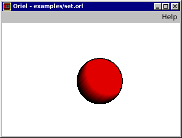
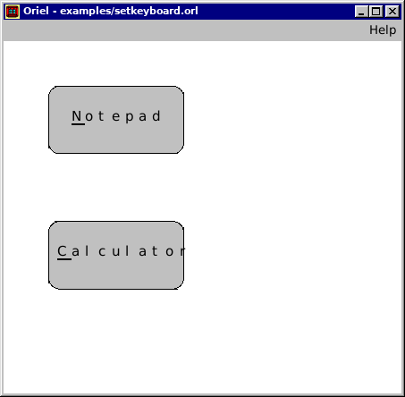

# Oriel

Oriel is a *"graphics-based batch language"* from the *Power Tools* series of books. This interpreter aims to accurately recreate the 1991 implementation of the language for Windows 3 on modern hardware using Rust and Gtk+3.

To read about Oriel, see the book's chapter in `book.pdf`

Support for the  1994 Windows NT version of Oriel may be added in the future, but "Windows NT Power Tools" is extremely elusive.




## Build

To compile the program, run
```
cargo build --release
```

Then, either run the program using cargo
```
cargo run --release source.orl
```

Or use the binary found at `target/release/oriel`.

## Examples

All of the 55 example programs from the book can be found in the `examples` directory. See [EXAMPLES.md](examples/EXAMPLES.md) for an index.

A hello world program looks as follows:
```
DrawText(10,10,"Hello world!")
WaitInput()
```

## License
```
Copyright (C) 2023  Wojciech Graj

This program is free software: you can redistribute it and/or modify
it under the terms of the GNU General Public License as published by
the Free Software Foundation, either version 3 of the License, or
(at your option) any later version.

This program is distributed in the hope that it will be useful,
but WITHOUT ANY WARRANTY; without even the implied warranty of
MERCHANTABILITY or FITNESS FOR A PARTICULAR PURPOSE.  See the
GNU General Public License for more details.
```

Portions of this software are copyright of their respective authors:
- [pest](https://github.com/pest-parser/pest), Licensed under the [MIT License](https://opensource.org/licenses/MIT)
- [thiserror](https://github.com/dtolnay/thiserror), Licensed under the [MIT License](https://opensource.org/licenses/MIT)
- [gtk3-rs](https://github.com/gtk-rs/gtk3-rs), Licensed under the [MIT License](https://opensource.org/licenses/MIT)
- [Gtk+3](https://gtk.org/), Licensed under the [LGPL-2.1+ License](https://opensource.org/licenses/LGPL-2.1)

A big thank you goes out to:
- Geoffrey T. LeBlond, William B. LeBlond, and Jennifer L. Palonus for creating the Oriel language and writing WINDOWS 3 POWER TOOLS
